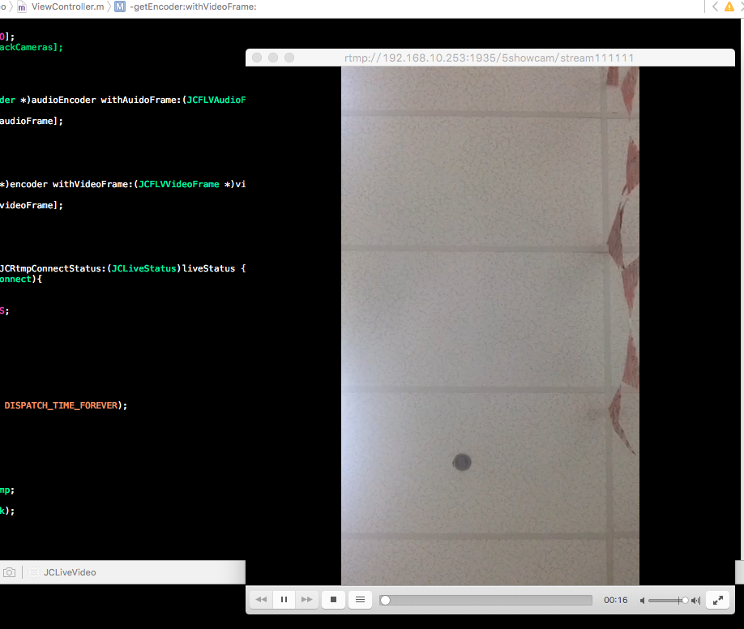

# JCLiveVideoKit
JCLiveVideoKit是一个rtmp推流工具，可实现在ios端采集音频视频数据然后推流，其中硬件编码只支持ios8.0以上

##使用
	//rtmp推流类
	self.rtmp = [[JCRtmp alloc] initWithPushURL:@"rtmp://	192.168.10.253:1935/5showcam/stream111111"];
	[self.rtmp setDelegate:self];

	//视频捕获及h.264压缩
	_videoCapture = [[JCVideoCapture alloc] init];
	self.jcH264Encoder = [[JCH264Encoder alloc] initWithJCLiveVideoQuality:JCLiveVideoQuality_Medium1];
	[self.jcH264Encoder setDelegate:self];

	//音频捕获及aac压缩
	_audioCapture = [[JCAudioCapture alloc] init];
	self.audioEncoder = [[JCAACEncoder alloc] init];
	[self.audioEncoder setDelegate:self];

	//rtmp推流类及音视频压缩后回调delegate
	
		- (void)getAudioEncoder:(JCAACEncoder *)audioEncoder withAuidoFrame:(JCFLVAudioFrame *)audioFrame {
    	if (self.uploading) {
        	[self.rtmp sendAudioFrame:audioFrame];
    	}
	}

		- (void)getEncoder:(JCH264Encoder *)encoder withVideoFrame:(JCFLVVideoFrame *)videoFrame {
    	if (self.uploading) {
        	[self.rtmp sendVideoFrame:videoFrame];
    	}
	}

		- (void)JCRtmp:(JCRtmp *)rtmp withJCRtmpConnectStatus:(JCLiveStatus)liveStatus {
    if(liveStatus == JCLiveStatusConnect){
    	}
	}

##效果

